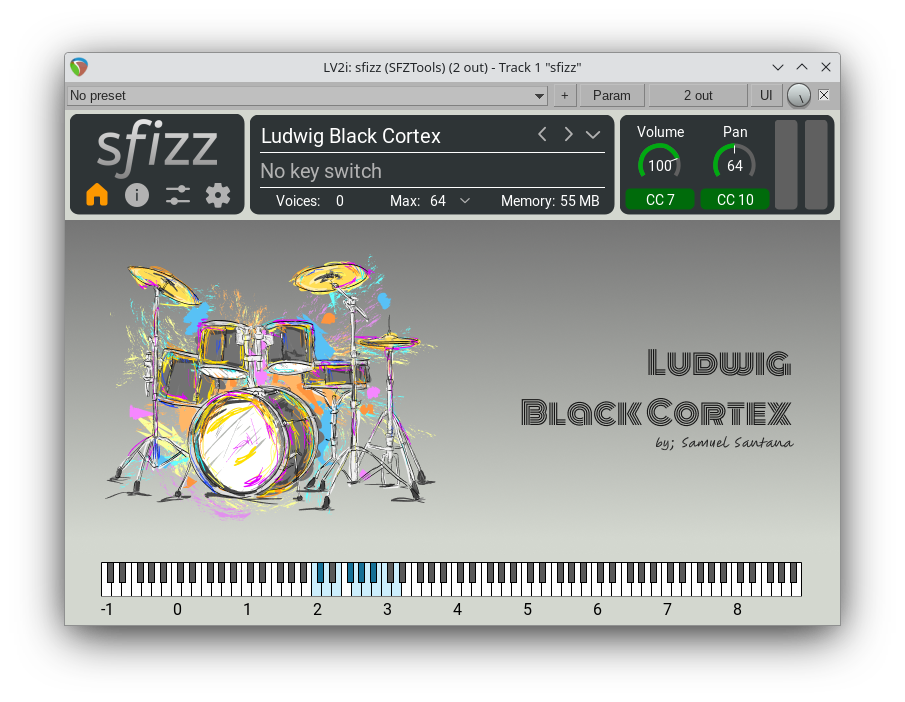

# Ludwig Black Cortex.sfz

## [DOWNLOAD](https://github.com/samuelsantanaoficial/LudwigBlackCortex/releases/tag/download)

## Sobre

1,68 GB de samples de áudio WAV, 24 bits, 44.100 Hz, de uma bateria Ludwig SuperClassic Black Cortex do final da década de 1970. Sete cascos de cinco camadas de bordo americano com uma camada central de choupo. Audios por; [Tchackpoum](https://www.tchackpoum.com/).

> Veja o vídeo demonstrativo [aqui](https://www.youtube.com/watch?v=KRnmregWpho).

* Kick Ludwig Super Classic - 22"x14"
* Snare Ludwig Super Classic - 13"x6,5"
* Racktoms Ludwig Super Classic 1 - 12"x8"
* Racktom Ludwig Super Classic 2 - 13"x9"
* Racktom Ludwig Super Classic 3 - 14"x10"
* Floortom Ludwig Super Classic 1 - 16"x16"
* Floortom Ludwig Super Classic 2 - 18"x18"
* Hihat Cymbal Istanbul Agop Signature 13"
* Ride Cymbal Istanbul Agop Singnature 22"
* Crash Cymbal 1 Sabian 14"
* Crash Cymbal 2 Sabian 16"
* Crash Cymbal 3 Istanbul Xist Ion Dark 19"

Gravado e editado com o software de áudio [Cockos Reaper](https://www.reaper.fm), com interface de áudio RME Fireface 802, prés da Audient e microfones da Electro Voice, Beyerdynamic, Sennheiser e AKG.

## Características

- [x] Round Robins (variações alternadas)
- [x] Mapeamento MIDI
    - [x] General MIDI
    - [ ] Superior Drummer
    - [ ] BFD3
- [ ] Controle de chimbal via MIDI CC#
- [ ] Saídas (8 canais)
- [x] Interface gráfica no sfizz
    - [x] Wallpaper na aba Home [Designed by Natanaelginting / Freepik](http://www.freepik.com)
    - [x] Wallpaper na aba Controls
    - [x] Botões giratórios (Knobs)
        - [x] Volume
        - [x] Pan (panorama)
        - [x] Expressão
        - [x] Afinação (Kick, Snare, Toms)

## Kit e Articulações
- [x] Kick
    - [x] Center
- [x] Snare
    - [x] Sidestick
    - [x] Center
    - [x] Edge
    - [ ] Rimshot
- [x] Racktom 1
    - [x] Center
    - [ ] Edge
- [x] Racktom 2
    - [x] Center
    - [ ] Edge
- [x] Racktom 3
    - [x] Center
    - [ ] Edge
- [x] Floortom 1
    - [x] Center
    - [ ] Edge
- [x] Floortom 2
    - [x] Center
    - [ ] Edge
- [x] Hihat
    - [x] Closed Edge
    - [x] Pedal
    - [x] Open Edge
- [x] Ride
    - [x] Bow
    - [x] Bell
    - [x] Edge
- [x] Crash 1
    - [x] Edge
- [x] Crash 2
    - [x] Edge
- [x] Crash 3
    - [x] Edge
